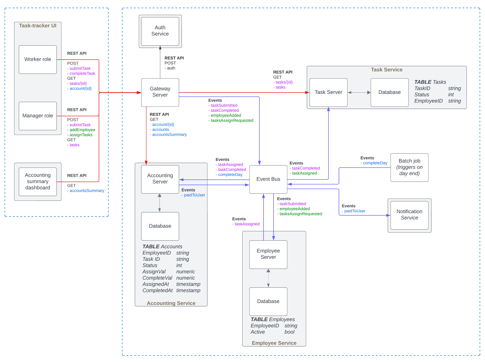

# Первоначальный дизайн системы

## Описание структуры

Выделены 5 сервисов
- Auth service (считаем, дан по умолчанию);
- Task service (ведет статус тасков);
- Employee service (ведет базу сотрудников, назначает сотрудника на таск);
- Notification service (используется для рассылки имейлов);
- Accounting service (назначает стоимость каждого таска, ведет учет баланса по каждому сотруднику, выдает аналитику).

Отдельно работает Batch job, который раз в день тригеррит подведение итогов дня и выплату зарплаты.

Клиенты общаются с сервером через отдельный Gateway server.

## Сомнительные моменты

- Точно нужен Task service? Выглядит, что его работу может выполнять Accounting service
- Не берет ли Accounting service на себя слишком много разнородных функций?
