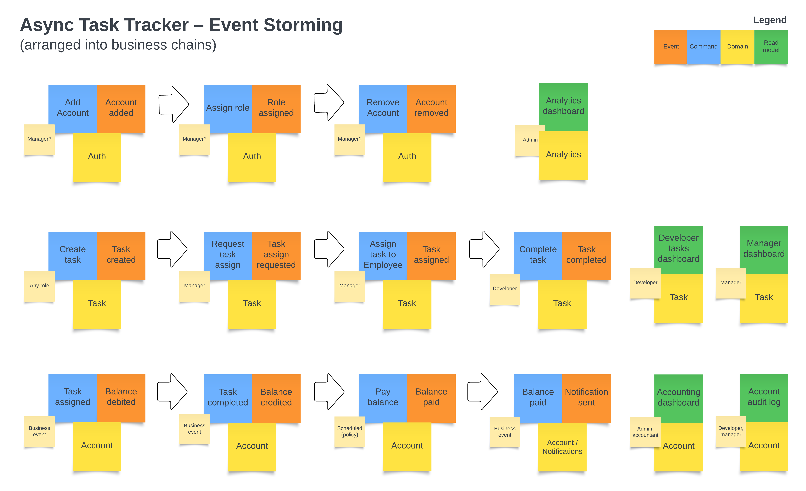
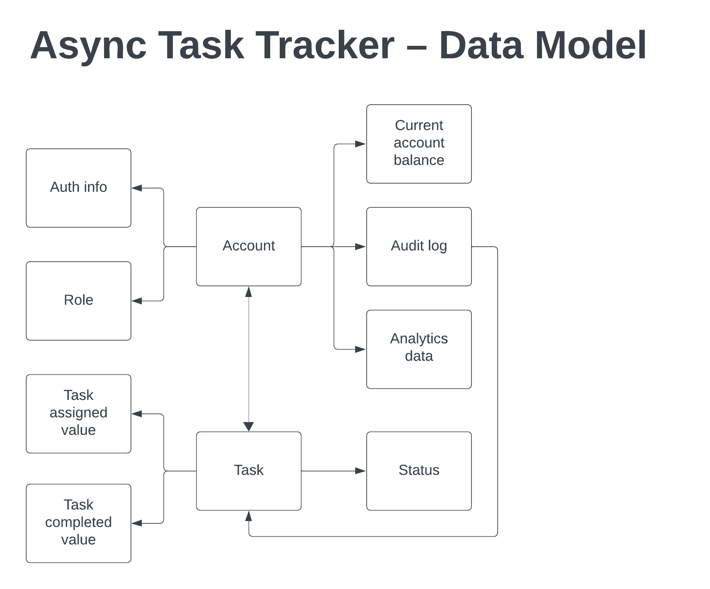
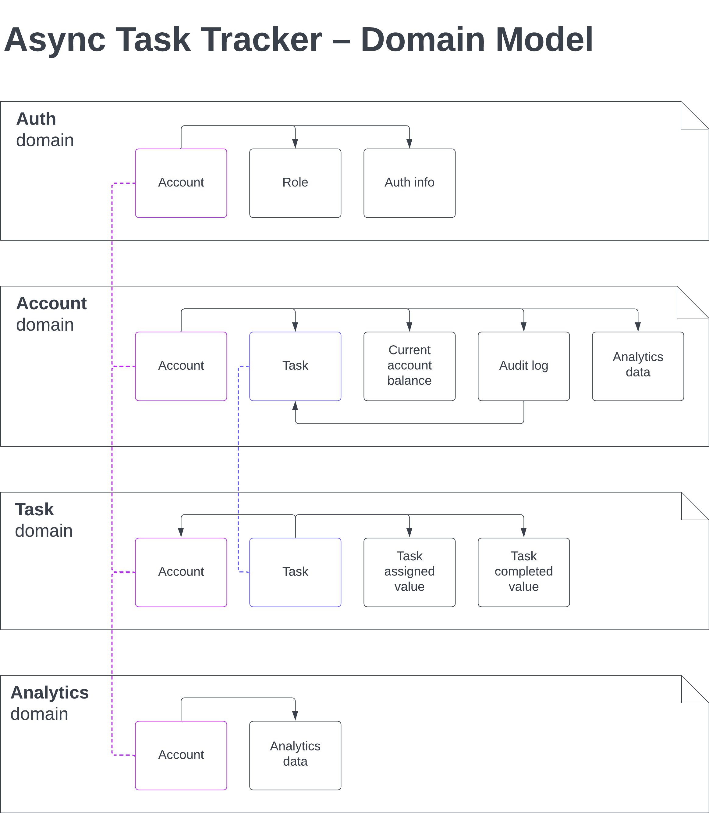
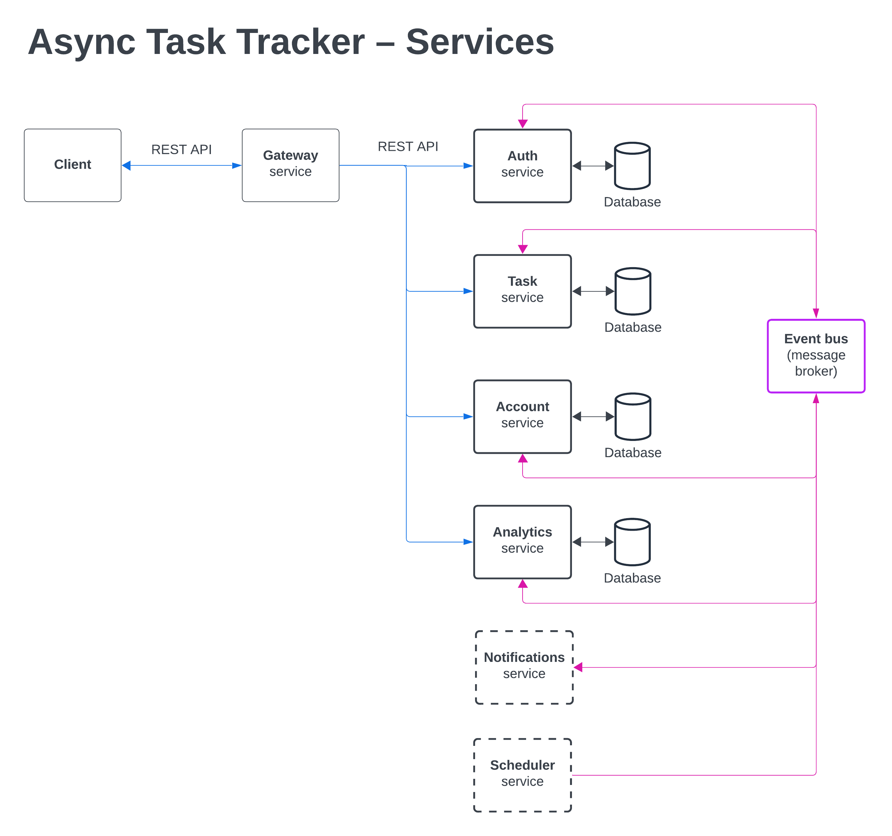
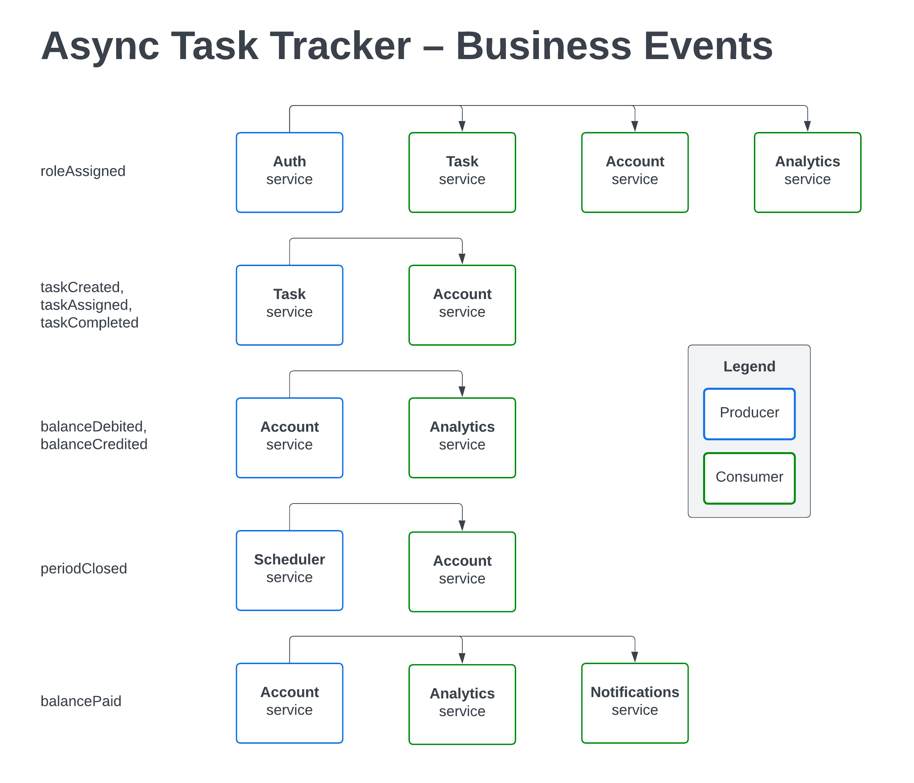

# Дизайн системы v1.0

## Event storming и business chains




## Data Model




## Domain Model




## Services




## Business Events




## CUD-events

На этапе подготовки архитектуры выглядит, что бизнес-событий и включенных в них данных должно быть достаточно для обмена данными между компонентами системы.

Тем не менее, CUD-события могут быть полезны, чтобы устранить дублирование логики в разных сервисах, например:
```
CUD-event: accountInfoChanged{
    role,
    account_status
}
Producer: Auth service
Consumer: Task, Account, Analytics services
```